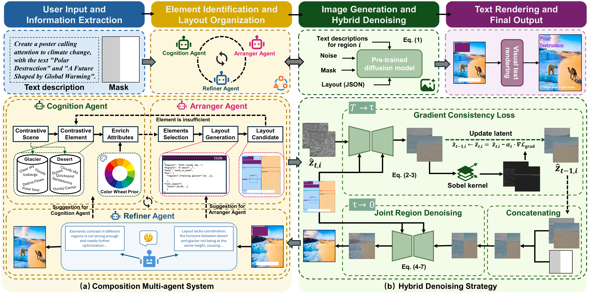

<div align="center">

# ReContraster: Making Your Posters Stand Out with Regional Contrast

</div>

<div align="center">

Peixuan Zhang,
Zijian Jia,
Ziqi Cai,
Shuchen Weng,
Si Li,
Boxin Shi

<a href="https://arxiv.org/abs/2604.10442"></a>

</div>

<div align="center">
  <a href="./assets/pipeline.pdf">
    
  </a>
</div>

## Abstract

**ReContraster** is a training-free poster generation system that uses regional contrast to make generated posters more salient and visually engaging.

<details><summary>CLICK for the full abstract</summary>

Effective poster design requires rapidly capturing attention while clearly conveying a message. Inspired by the contrast-effects principle, ReContraster introduces a compositional multi-agent system that identifies visual elements, organizes their layout, and evaluates generated poster candidates. To ensure harmonious transitions across region boundaries, the system integrates a hybrid denoising strategy into the diffusion process. We also introduce a benchmark dataset for comprehensive evaluation. Experiments with seven quantitative metrics and four user studies demonstrate that ReContraster produces visually striking and aesthetically appealing posters.

</details>

## 🧩 Method

Given a poster request and a regional mask, ReContraster runs the following workflow:

1. **Text extraction** separates the poster theme from text that should be rendered at the end.
2. **Element Generator** proposes two semantically contrasting regional scenes.
3. **Layout Generator** assigns regional elements and normalized bounding boxes, while reserving space for typography.
4. **CreatiLayout + Stable Diffusion 3** synthesizes the image under the regional layout and mask constraints.
5. **Critictor** checks the candidate poster and requests element or layout regeneration when necessary.
6. **Text renderer** places the extracted visual text on the accepted image with automatic wrapping, sizing, contrast color, and stroke.

The diffusion stage removes text descriptions from the generation prompt. Text is rendered separately so that the final slogan remains readable and controllable.

## 🛠️ Installation

### Requirements

- Linux with an NVIDIA GPU and a CUDA-compatible PyTorch installation
- Python **3.10**
- PyTorch **2.5.1** with CUDA 12.1
- A reachable OpenAI-compatible vision-language API
- Stable Diffusion 3 and CreatiLayout/SiamLayout checkpoints

### Setup

Create a clean Conda environment and install the CUDA-enabled PyTorch build:

```bash
conda create -n recontraster python=3.10 -y
conda activate recontraster

pip install torch==2.5.1 torchvision==0.20.1 torchaudio==2.5.1 \
  --index-url https://download.pytorch.org/whl/cu121

# Clone this repository first, then enter its directory.
cd ReContraster
pip install -r requirements.txt
```

`flash-attn` is optional and is not installed by `requirements.txt` because its build depends on the local CUDA toolkit and compiler. Install it separately when your GPU environment supports it:

```bash
pip install flash-attn --no-build-isolation
```

### Download checkpoints

Download the two required checkpoints from Hugging Face. You may choose any local storage location; the paths are passed to the pipeline through environment variables.

- [Stable Diffusion 3 Medium](https://huggingface.co/stabilityai/stable-diffusion-3-medium-diffusers)
- [CreatiLayout](https://huggingface.co/HuiZhang0812/CreatiLayout)

Install the Hugging Face CLI if necessary and download them with:

```bash
pip install -U "huggingface_hub[cli]"

huggingface-cli download stabilityai/stable-diffusion-3-medium-diffusers \
  --local-dir ./checkpoints/stable-diffusion-3-medium-diffusers
huggingface-cli download HuiZhang0812/CreatiLayout \
  --local-dir ./checkpoints/CreatiLayout
```

Stable Diffusion 3 may require accepting the model license and authenticating with Hugging Face first:

```bash
huggingface-cli login
```

Set the checkpoint paths. `CREATILAYOUT_MODEL_PATH` must contain a `transformer/config.json` file. If the downloaded CreatiLayout repository stores the transformer weights in a nested directory, point the variable to a small wrapper directory as follows:

```bash
export SD3_MODEL_PATH="$PWD/checkpoints/stable-diffusion-3-medium-diffusers"

mkdir -p "$PWD/checkpoints/CreatiLayout_checkpoint"
ln -sfn "$PWD/checkpoints/CreatiLayout/transformer" \
  "$PWD/checkpoints/CreatiLayout_checkpoint/transformer"
export CREATILAYOUT_MODEL_PATH="$PWD/checkpoints/CreatiLayout_checkpoint"
```

指标评估脚本如需使用美学模型，请额外设置 `AESTHETIC_CLIP_PATH` 和
`AESTHETIC_HEAD_PATH`；Llama 示例入口使用 `LLAMA_MODEL_PATH` 及
`LLAMA_IMAGE_1`/`LLAMA_IMAGE_2`。

Set the API configuration in your shell. Do not commit API keys to the repository.

```bash
read -s -p "API key: " RECONTRASTER_API_KEY
echo
export RECONTRASTER_API_KEY
export RECONTRASTER_BASE_URL="https://api.openai.com/v1"
export RECONTRASTER_AGENT_MODEL="gpt-4o"
```

The API must expose an OpenAI-compatible `chat.completions` endpoint with multimodal image input. `RECONTRASTER_BASE_URL` is the provider's API base URL (usually ending in `/v1` or `/api/v3`), and `RECONTRASTER_AGENT_MODEL` is the exact model ID accepted by that provider. The defaults are OpenAI's official API endpoint and `gpt-4o`; set both variables when using another provider.

Optional agent reliability settings:

```bash
export RECONTRASTER_AGENT_TIMEOUT="120"       # request timeout in seconds
export RECONTRASTER_AGENT_MAX_RETRIES="3"     # retries for transient API errors
export RECONTRASTER_AGENT_RETRY_DELAY="5"     # initial retry delay in seconds
```

## 🚀 Inference

### Single poster

Set the input mask, output locations, and poster request, then run:

```bash
export RECONTRASTER_MASK_PATH="$PWD/inputs/mask2.png"
export RECONTRASTER_OUTPUT_DIR="$PWD/outputs"
export RECONTRASTER_FINAL_PATH="$PWD/outputs/final.png"
export RECONTRASTER_PROMPT="Design a contrast poster calling for wildfire prevention"
export RECONTRASTER_MAX_TIMES="3"

python multi_agent.py 2>&1 | tee run_recontraster.log
```

`RECONTRASTER_MAX_TIMES=1` is useful for a short smoke test. The default API endpoint in the code is a generic OpenAI-compatible endpoint; set `RECONTRASTER_BASE_URL` explicitly for your provider.

### Output

For a run with output directory `outputs/`, the pipeline writes:

- `outputs/img_0.png`: first candidate poster
- `outputs/img_1.png`, ...: candidates produced during critic-guided regeneration
- `outputs/final.png`: accepted candidate with final text rendering
- `run_recontraster.log`: optional complete console log

The program prints timing and agent-call statistics as JSON after completion.

### Direct image generation

`tool_generate.py` can invoke CreatiLayout without the language-model loop. Its JSON input must contain `region1`, `region2`, `box`, and `mask`:

```json
{
  "tool": "CreatiLayout",
  "input": {
    "region1": "A tranquil and harmonious landscape depicting a peaceful countryside. The scene includes a serene river flowing through lush fields with wildflowers, and soft, rolling hills under a bright and clear sky. A person in casual attire is sitting on the riverbank, reading a book, reflecting the calm and peaceful atmosphere.",
    "region2": "A stark and chaotic battlefield representing the devastation of war. The scene includes a barren landscape with scorched earth, broken artillery, and abandoned trenches under a gloomy, overcast sky. A solitary soldier in combat gear sits on a piece of rubble, looking somberly away, portraying the impact and sorrow of war.",
    "box": {
      "region1": {
        "clear sky": [0.0, 0.0, 1.0, 0.3],
        "rolling hills": [0.0, 0.3, 1.0, 0.6],
        "serene river": [0.3, 0.6, 0.7, 0.9],
        "wildflowers": [0.2, 0.7, 0.8, 1.0],
        "person reading a book": [0.4, 0.6, 0.6, 0.8]
      },
      "region2": {
        "overcast sky": [0.0, 0.0, 1.0, 0.3],
        "abandoned trenches": [0.0, 0.3, 1.0, 0.6],
        "broken artillery": [0.5, 0.6, 0.8, 0.9],
        "scorched earth": [0.0, 0.6, 0.5, 1.0],
        "solitary soldier": [0.4, 0.6, 0.6, 0.8]
      }
    },
    "mask": "inputs/mask2.png"
  },
  "output": "outputs/poster_peace_war.png",
  "seed": 41,
  "guidance_scale": 7,
  "c_T": 4,
  "num_inference_steps": 50
}
```

Save this structure as `gen_text.json` and run `python tool_generate.py --json_out True` after exporting the model paths above.

## 📁 Repository Structure

- `multi_agent.py`: main single-poster multi-agent pipeline.
- `tool_generate.py`: model-path validation and CreatiLayout invocation.
- `util/agent_tree.py`: OpenAI-compatible multimodal agent wrapper with retries.
- `util/poster_text.py`: text extraction, response parsing, layout normalization, and text removal from diffusion prompts.
- `util/text_add.py`: final typography renderer.
- `templates/`: system prompts for the text extractor, element generator, layout generator, and critic.
- `CreatiLayout/`: SiamLayout/CreatiLayout implementation used by the diffusion stage.
- `metric/`: boundary, style, and aesthetic metric utilities.
- `inputs/` and `masks/`: example regional masks.

## Acknowledgements

This project uses [CreatiLayout](https://github.com/HuiZhang0812/CreatiLayout) and its SiamLayout implementation for layout-to-image generation. Please also refer to the [CreatiLayout model](https://huggingface.co/HuiZhang0812/CreatiLayout) and cite the original work when using this component.

```bibtex
@article{zhang2024creatilayout,
  title={CreatiLayout: Siamese Multimodal Diffusion Transformer for Creative Layout-to-Image Generation},
  author={Zhang, Hui and Hong, Dexiang and Gao, Tingwei and Wang, Yitong and Shao, Jie and Wu, Xinglong and Wu, Zuxuan and Jiang, Yu-Gang},
  journal={arXiv preprint arXiv:2412.03859},
  year={2024}
}
```

## ⚠️ Notes

- Full inference requires GPU memory for Stable Diffusion 3 and CreatiLayout; CPU-only execution is intended only for utility tests such as text rendering.
- The mask and layout boxes use normalized coordinates `[x1, y1, x2, y2]` in the range `[0, 1]`.
- API calls may take several minutes. The agent wrapper retries transient failures with exponential backoff; adjust `RECONTRASTER_AGENT_TIMEOUT`, `RECONTRASTER_AGENT_MAX_RETRIES`, and `RECONTRASTER_AGENT_RETRY_DELAY` when needed.

## Citation

```bibtex
@article{zhang2026recontraster,
  title={ReContraster: Making Your Posters Stand Out with Regional Contrast},
  author={Peixuan Zhang and Zijian Jia and Ziqi Cai and Shuchen Weng and Si Li and Boxin Shi},
  journal={arXiv preprint arXiv:2604.10442},
  year={2026}
}
```
